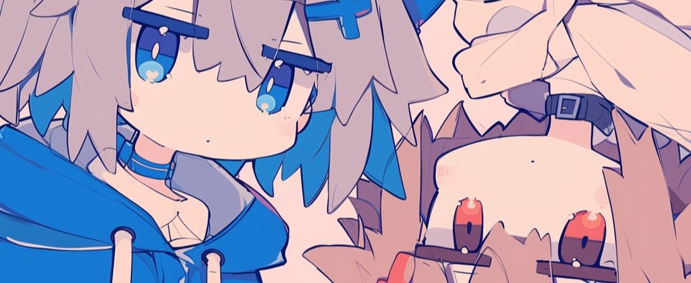

 
  
  
  
  
  
  
  
  

 

## 高二学生 & OIer[AFK]

喜欢编程，初中整图形库与Unity，但可怜的OI之路却一眼就望到了头……

**如果可以 请送我一张书签 🔖**

* 2023/11/19更新：NOIP考完了，CSP-S水了个一等奖，结束啦！

### My Skills

### My projects

| 仓库 | 简介 | 状态 |
| :--- | :--- | :--- |
| [Frosti](https://github.com/EveSunMaple/Frosti) | 一个使用 Astro 制作的博客主题，注重性能与美观。项目 Demo ： https://frosti.saroprock.com/ | 🟢 更新中 |
| Astion | 一个使用 Astro 制作的 `社交网络` ，与 Notion 息息相关 |  🔵 验证中 |
| astro-comment | 专门为 Astro 站点打造的评论系统 |  🟡 画饼中 |

### GitHub Stats

  
  

### My Personal OC

*因为我是双子座，所以有两个人也很合理吧*